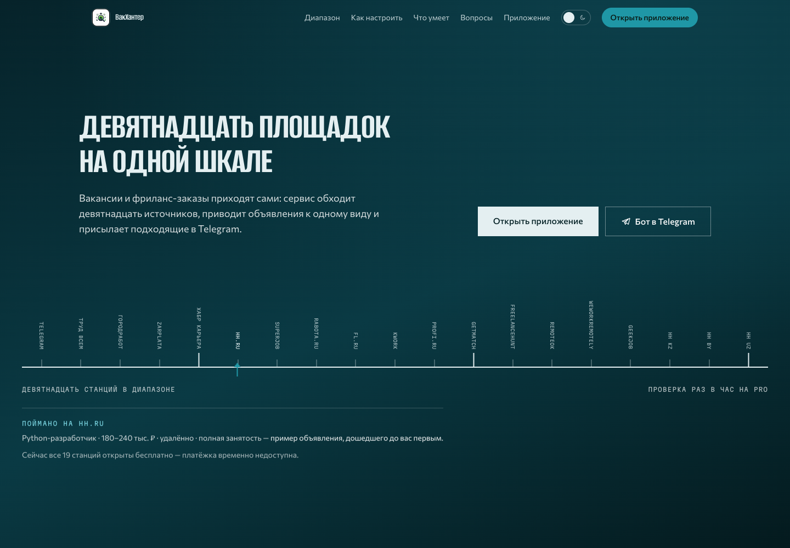

# VakHunter

Сервис для поиска вакансий и фриланс-заказов в одном потоке — в Telegram и на сайте. Подходит для специалистов разных профессий: от IT и удалённой работы до продаж, медицины, рабочих специальностей и подработки.

## Что умеет

- ищет вакансии и заказы сразу по нескольким площадкам;
- объединяет похожие результаты и помогает не дублировать отклики;
- поддерживает поиск по профессии, городу, формату занятости и уровню дохода;
- создаёт подписки и периодически присылает новые подходящие предложения;
- даёт профиль пользователя и сохраняет сигналы интереса, чтобы улучшать ранжирование выдачи.

Карточки вакансий и заказов различаются, а переход к отклику всегда остаётся за пользователем: VakHunter не откликается и не пишет работодателю от его имени.

## Как работает

Пользователь задаёт запрос на сайте или в Telegram. Сервис получает предложения из подключённых источников, убирает повторы и показывает выдачу. Личный кабинет помогает работать с профилем и подписками; уведомления о новых совпадениях приходят в Telegram.

## Ссылки

- Сайт и личный кабинет: [vakhunter.codoceh.ru](https://vakhunter.codoceh.ru)
- Telegram-бот: [@VakHunter_bot](https://t.me/VakHunter_bot)

## Статус исходного кода

Это публичная карточка продукта CodoCeh. Исходный код, конфигурация, ключи интеграций, пользовательские данные и рабочие сборки здесь не публикуются.
